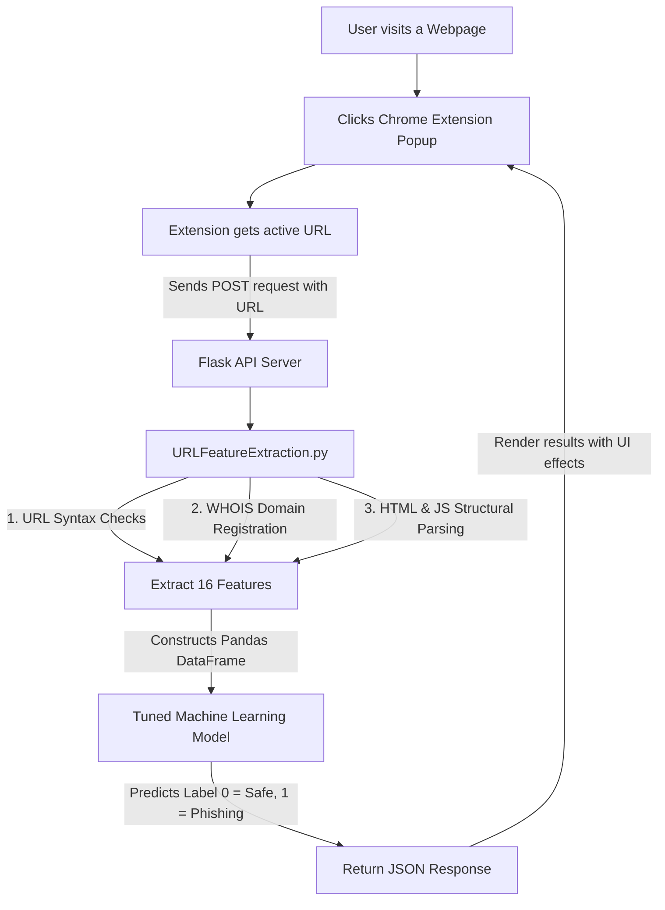

# PhishGuard AI — Phishing Detection Chrome Extension & API

> **Detect. Explain. Protect.**

An AI-powered web security system that detects phishing websites in real-time. The project consists of a modern, lightweight Google Chrome Extension that communicates with a Flask-based backend server. The backend runs feature extraction on the scanned URL and queries a tuned Machine Learning classifier to output a prediction ("Safe" vs. "Phishing").

> **Status — milestone P0 (repository bootstrap).** This README is the legacy
> upstream document. It is being replaced as part of the PhishGuard AI
> rebuild; numbers inherited from upstream are labelled `UNVERIFIED` until the
> reproducible evaluation framework lands. See [`models/MODEL_CARD.md`](models/MODEL_CARD.md)
> and [`DataFiles/DATASETS.md`](DataFiles/DATASETS.md).

---

## 🏗️ Project Architecture



---

## ⚡ Key Features & URL Parsing

When a URL is scanned, the backend extracts **16 key features** categorized into three main categories:

1. **Address Bar (Syntax) Features**:
   - Presence of an IP address in the domain
   - Presence of `@` symbols (used to redirect and ignore preceding text)
   - URL length check (URLs $\ge$ 54 characters classified as higher risk)
   - Path depth (count of subfolders)
   - Redirection symbol `//` locations
   - Existence of `http/https` inside the domain name (phishing spoofing)
   - Use of common URL shortening services (e.g., bit.ly, tinyurl)
   - Prefix/suffix dashes `-` in the domain name

2. **Domain-Based Features**:
   - **DNS Record**: Presence/availability of records in the DNS registrar.
   - **Web Traffic**: Global popularity rating (falls back to a default value since the Alexa API decommissioning).
   - **Domain Age**: Age calculated between creation and expiration dates (minimum 12 months for legitimate sites).
   - **Domain End**: Remaining duration before domain expiry.

3. **HTML & JavaScript Features**:
   - **IFrame Redirection**: Invisible frames used to overlay content.
   - **Status Bar Customization**: Detection of `onmouseover` event overrides.
   - **Disabling Right Click**: Prevention of users viewing page source code.
   - **Website Forwarding**: Number of times the response has redirected (limit of $\le 2$ for legitimate sites).

---

## 📊 Machine Learning Models & Dataset

The models are trained on a balanced dataset of **10,000 URLs** (5,000 legitimate URLs and 5,000 phishing URLs sourced from PhishTank feeds) using 16 extracted feature columns.

Two classifiers are shipped in [`models/`](models/):

* **Random Forest** (500 estimators) — `models/random_forest.joblib` *(primary model used by the API)*
* **XGBoost** (`n_estimators=500`, `max_depth=8`) — `models/xgboost.joblib`

> ⚠️ **Metrics are UNVERIFIED.** Upstream quoted 85.95% / 85.70% accuracy from a
> single random split of a dataset containing only 771 unique feature vectors
> across 10,000 rows — i.e. heavy train/test leakage. Those figures are
> recorded for traceability in [`models/MODEL_CARD.md`](models/MODEL_CARD.md)
> and are **not** claims of detection quality. Leakage-free, domain-disjoint
> evaluation is tracked as milestone P2/P8.

---

## 🚀 Setup and Run Guide

### 1. Run the Flask Backend
Make sure you have Python 3.11+ installed (CI tests 3.11 / 3.12 / 3.13).

1. Navigate to the project root folder:
   ```bash
   cd phishguard-ai
   ```
2. Create and activate a virtual environment:
   ```bash
   python -m venv venv
   # On Windows:
   venv\Scripts\activate
   # On macOS/Linux:
   source venv/bin/activate
   ```
3. Install the dependencies:
   ```bash
   pip install -r requirements.txt        # runtime
   pip install -r requirements-dev.txt    # + pytest, ruff (development)
   ```
4. Start the Flask server:
   ```bash
   python app.py
   ```
   The API will now be running locally at `http://127.0.0.1:5000/`.
   Verify with `curl http://127.0.0.1:5000/health`.

5. Run the test suite (offline):
   ```bash
   pytest -m "not network"
   ruff check .
   ```

---

### 2. Load the Google Chrome Extension

1. Open Google Chrome and navigate to `chrome://extensions/`.
2. Turn on **Developer mode** using the toggle switch in the top-right corner.
3. Click the **Load unpacked** button in the top-left corner.
4. Select the `Phishing_detection_app/chrome_extension` folder inside this project.
5. The extension "Phishing Detector" is now loaded! Pin it to your Chrome toolbar.
6. Open any website in your browser, click the extension icon, and select **Scan Current Page**.

---

## 🌐 Production Deployment

To host the API server in production (e.g., on [Render](https://render.com/) or Heroku):

1. Deploy the backend using the included [`render.yaml`](render.yaml) blueprint or by binding the server to a Gunicorn start command:
   ```bash
   gunicorn app:app
   ```
2. Update the `API_URL` variable inside the Chrome Extension's [`popup.js`](Phishing_detection_app/chrome_extension/popup.js):
   ```javascript
   // Replace localhost with your production server URL
   const API_URL = 'https://your-phishing-detection-api.onrender.com/predict';
   ```

---

## 📁 File Structure

* [`app.py`](app.py) - Flask web API exposing `/predict` and `/health`.
* [`URLFeatureExtraction.py`](URLFeatureExtraction.py) - Legacy feature extraction module (URL syntax, WHOIS, page structure). Being replaced by a single unified pipeline in milestone P2.
* [`train_model.py`](train_model.py) - Training script; writes explicitly named artifacts to `models/`.
* [`models/`](models/) - Model registry: `random_forest.joblib`, `xgboost.joblib`, `registry.json`, and [`MODEL_CARD.md`](models/MODEL_CARD.md) (provenance, schema, known limitations).
* [`tests/`](tests/) - Offline test suite (registry integrity, API smoke, lexical features).
* [`Phishing_detection_app/chrome_extension/`](Phishing_detection_app/chrome_extension/) - Chrome Extension assets (`manifest.json`, `popup.html`, `popup.js`).
* [`DataFiles/`](DataFiles/) - Dataset CSVs plus [`DATASETS.md`](DataFiles/DATASETS.md) (measured statistics, provenance, known leakage).
